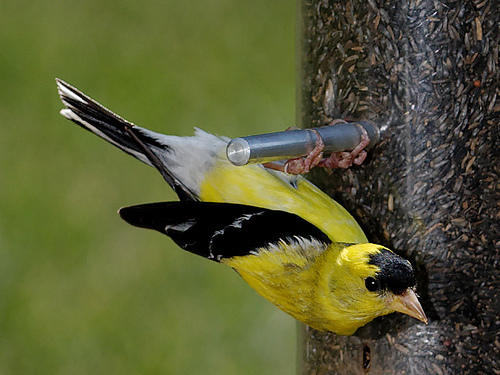
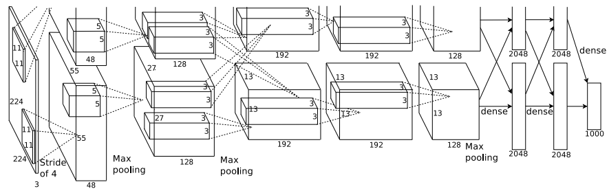
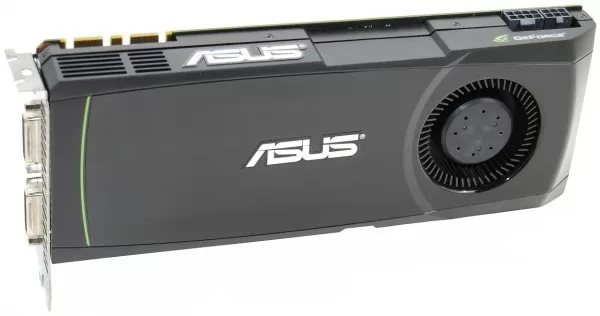
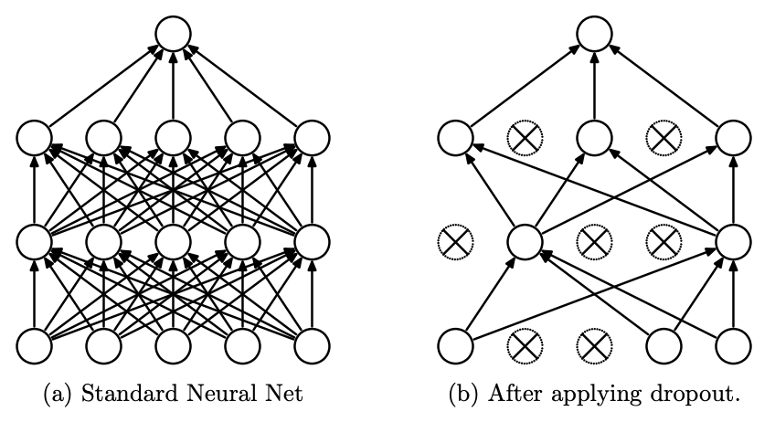

## ImageNet Classification with Deep Convolutional Neural Networks {.center style="text-align: right;"}

A. Krizhevsky; I. Sutskever; G. E. Hinton (2012)

::: {style="color: #5A5A5A"}

Historical Paper Review

:::

#### Patrick Li {style="margin-top: 40px; font-size: 0.9em"}

::: {style="font-size: 0.9em"}

BDSI, ANU

:::

---

## Overview

1. The 1998 - 2012 computer vision landscape
2. ImageNet and the object recognition problem  
3. AlexNet architecture innovations
4. Data augmentation
5. Stochastic Gradient Descent (SGD)
6. Breakthrough results and impact

---

## The 1998 - 2012 computer vision landscape


```{mermaid}
%%{init: {'themeVariables': { 'fontSize': '20px'}}}%%
timeline
    title The Dawn of Deep Learning (1998-2012)
        1998 : LeNet-5 
        2006 : Deep Belief Nets : Layer-wise Training
        2008 : Denoising Autoencoders
        2009 : GPU Acceleration : ImageNet
        2010 : Deep Big Simple Nets : ReLU Activation Becomes Popular : ILSVRC
        2011 : High Performance CNNs
        2012 : Dropout : AlexNet
```

---

## The object recognition problem

::: {style="font-size:80%"}


Object recognition requires models that **generalize across many visual categories**. 

CNNs are particularly well-suited for this task due to **two key assumptions about image**: 

1. **Stationarity of statistics** (patterns like edges appear throughout the image) 
2. **Locality of pixel dependencies** (nearby pixels are more related)


::: {.callout-note}
Compared to fully connected networks, CNNs have far fewer parameters due to weight sharing and local connectivity, making them easier to train and more data-efficient. Although the theoretical best performance may be slightly lower, practical performance is often superior.
:::


:::


---

## Dataset

:::: {.columns}
::: {.column width=50%}



:::
::: {.column width=50%}


::: {style="font-size:80%"}

**ImageNet** contains over 15 million labeled high-resolution images across more than 22,000 categories.

**ILSVRC 2012** (ImageNet Large Scale Visual Recognition Challenge) uses a curated subset:

* \~1.2 million training images
* \~50,000 validation images
* \~150,000 test images


:::

:::
::::


---

## AlexNet


::: {style="font-size:70%"}


**AlexNet** consists of **five convolutional layers** followed by **three fully connected layers**. It outputs predictions across 1,000 classes using a softmax layer and contains approximately **61 million parameters**.


> *Deeper networks lead to better performance* (Simonyan & Zisserman, 2014)


:::




---

## ReLU activation

Instead of traditional tanh or sigmoid activations, AlexNet uses the **Rectified Linear Unit (ReLU)**:

$$
f(x) = \max(0, x)
$$

ReLU enabled **significantly faster training** and helped avoid vanishing gradients, quickly becoming the default activation in deep learning.

---

## Multi-GPU training

::: {style="font-size:80%"}

To handle memory constraints, AlexNet splits its architecture across **two GPUs**:

* Each GPU processes a **subset of the filters**.
* Communication occurs at certain layers.

This kind of **manual model parallelism** is uncommon in modern architectures, which typically use **data parallelism**.

:::

:::: {.columns}
::: {.column width=50%}



:::
::: {.column width=50%}


<br>

::: {style="font-size:80%"}


$$\text{GTX 580} \times 2 \approx \text{H100} \times 0.002$$

:::


:::
::::


---

## Local Response Normalization (LRN)

**Local Response Normalization** mimics **lateral inhibition** seen in biological neurons. For a given neuron at spatial location $(x, y)$ in channel $i$, the normalized activation is:

$$
b_{x,y}^i = \frac{a_{x,y}^i}{\left(k + \alpha \sum_{j = \max(0, i - n/2)}^{\min(N - 1, i + n/2)} (a_{x,y}^j)^2 \right)^\beta}
$$

AlexNet uses $k=2$, $n=5$, $\alpha=10^{-4}$, $\beta=0.75$.

This technique normalizes across adjacent feature maps. It was later largely replaced by **Batch Normalization**.

---

## Overlapping pooling

:::: {.columns}
::: {.column width=70%}


Instead of using disjoint pooling windows, AlexNet uses **overlapping max pooling**:

* Pooling window: 3×3
* Stride: 2

While reducing over-fitting in their application, this strategy is now rarely used.


:::
::: {.column width=30%}

```{r}
magick::image_read_pdf("figures/overlapping_pooling.pdf", pages = 1)
```

:::
::::


---


## Data augmentation

Images are resized so the shorter side is 256 pixels, then cropped to 224×224 with mean pixel subtraction.

* **Training:** Random 224×224 crops and horizontal flips.
* **Prediction:** Five fixed 224×224 crops (four corners + center) plus their horizontal flips, totaling 10 views. Final prediction is the average of these.

---

## RGB color augmentation

::: {style="font-size:80%"}

To simulate varying lighting conditions, **PCA-based color augmentation** is applied:

* Compute the **principal components** of RGB values on the training set.
* For each image of each batch,

$$
\text{add } \sum_{i=1}^3 \alpha_i \lambda_i p_i \text{ to each pixel},
$$

where $\lambda_i$ are eigenvalues, $p_i$ are eigenvectors, and $\alpha_i \sim \mathcal{N}(0, 0.1)$.

:::


---

## Dropout

:::: {.columns}
::: {.column width=50%}



:::
::: {.column width=50%}

::: {style="font-size:80%"}


**Dropout** is used in the fully connected layers to **prevent overfitting**:

* During training, each neuron is **randomly dropped with probability 0.5**.
* At prediction time, all neurons are used, and outputs are **scaled by 0.5**.

This technique reduces complex **co-adaptations of neurons** and improves generalization.


:::


:::
::::


---

## Optimization

::: {style="font-size:80%"}

Optimization is performed with **Stochastic Gradient Descent** (SGD):


$$
v_{i+1} = \mu v_i - \eta \left( \nabla_\theta J(\theta_i)_{D_i} + \lambda \theta_i \right)
$$

$$
\theta_{i+1} = \theta_i + v_{i+1},
$$
where $\theta$ is the model parameters, $v$ is the velocity, $\eta$ is the learning rate, $\mu = 0.9$ is the momentum, $\lambda = 0.0005$ is the weight decay, and $\nabla_\theta J(\theta)_{D_i}$ is the gradient of the loss with respect to parameters average over the batch $D_i$.

::: {.callout-note}
## Training details
- $\theta$ initialized from $\mathcal{N}(0, 0.01)$
- Biases in ReLU layers set to 1 to ensure gradient flow
- $\eta$ starts at 0.01, divided by 10 when validation error plateaus
- Total of 3 $\eta$ reductions; training stops after \~90 epochs (\~5–6 days on 2 GPUs)
:::

:::

---

## Results

::: {style="font-size:80%"}

AlexNet achieved **breakthrough performance** in ILSVRC 2012:

| Model                 | Top-1 Error | Top-5 Error |
| --------------------- | ----------- | ----------- |
| Single CNN    | 40.7%       | 18.2%       |
| Ensemble of 5 CNNs    | 38.1%       | 16.4%       |
| Pretrained single CNN | 39.0%       | 16.6%       |
| Pretrained ensemble   | **36.7%**   | **15.4%**   |

::: {.callout-tip}

## Additional observations


* Early layers learn color-agnostic (GPU1) and color-specific (GPU2) features.
* Top-5 predictions tend to be **semantically close**.
* **Euclidean distances** in fully connected layer representations reflect **visual similarity**.


:::


:::


---

## Takeaways

::: {style="font-size:80%"}


1. **Depth matters**: removing layers degrades performance.
2. **ReLU** drastically improved training speed.
3. **Multi-GPU training** enabled large model capacity.
4. **Aggressive data augmentation** and **dropout** improved generalization.
5. **Large-scale end-to-end learning** proved effective (**again**).

> **This work marked the turning point for deep learning in computer vision**, laying the foundation for modern models like VGG, ResNet, and beyond.


:::

---

## Thanks! Any questions? {.center}

<br>

- `r shiny::icon("code")` [TengMCing/computer_vision_review](https://github.com/TengMCing/computer_vision_review)
- `r shiny::icon("github")` [TengMCing](https://github.com/TengMCing)
- `r shiny::icon("envelope")` [patrick.li@anu.edu.au](mailto:patrick.li@anu.edu.au)
- `r shiny::icon("user")` [https://patrickli.org](https://patrickli.org)

